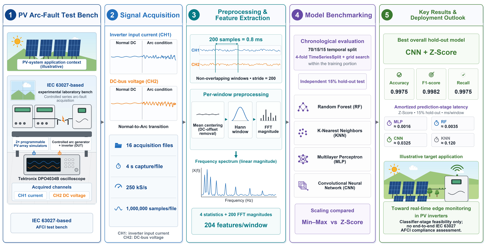

# FFT-Based PV Arc-Fault Detection Benchmark

[](https://doi.org/10.3390/en19163787)
[](https://www.python.org/)
[](https://github.com/MichelOliveira47/pv-arc-fault-fft-benchmark/actions/workflows/ci.yml)

Companion code for the open-access *Energies* article:

> Oliveira, M. B. de; Ramos, F.; Almeida Neto, J. C. de S.; Almeida, F. J. M.; Lima, B. L. S. “Benchmarking RF, KNN, MLP, and CNN for FFT-Based PV Arc Fault Detection: Scaling Choice, Temporal Cross-Validation, and Latency Trade-Offs Toward Edge Deployment.” *Energies* **2026**, *19*(16), 3787. [https://doi.org/10.3390/en19163787](https://doi.org/10.3390/en19163787)

The workflow compares Random Forest (RF), K-Nearest Neighbors (KNN), Multilayer Perceptron (MLP), and Convolutional Neural Network (CNN) classifiers under min-max and Z-score scaling. It reproduces the article's signal windowing, FFT feature extraction, chronological evaluation, temporal cross-validation, model serialization, latency measurement, and supplementary robustness analyses.



## Release status

The published article states that the source code was under institutional, project, and intellectual-property restrictions at publication time and could be considered for release after the applicable embargo. This repository is therefore prepared as a private release candidate. Public visibility and an open-source license must only be enabled after the corresponding authorization has been confirmed.

## Method at a glance

- Input: 16 labeled experimental files with inverter input current (`CH1`), DC-bus voltage (`CH2`), and sample-level labels (`CLASSIFIER`).
- Windowing: fixed, non-overlapping 200-sample windows at 250 kS/s (0.8 ms per window).
- Preprocessing: per-window mean centering and Hann windowing.
- Features: four time-domain statistics plus 100 FFT magnitudes per channel, totaling 204 features per window.
- Evaluation: chronological 70/15/15 train/validation/test split, with four-fold `TimeSeriesSplit` grid search inside the training portion.
- Models: RF, KNN, MLP, and CNN under min-max and Z-score scaling.
- Outputs: feature tables, fitted models, predictions, metrics, latency measurements, figures, and supplementary audit tables.

The article reported the best hold-out result for CNN with Z-score scaling (accuracy 0.9975, F1-score 0.9982, recall 0.9975). MLP with Z-score scaling had the lowest reported amortized classifier-stage latency, approximately 0.0016 ms per feature vector. Latency is hardware- and software-dependent.

## Repository layout

```text
.
|-- .github/
|   |-- ISSUE_TEMPLATE/
|   `-- workflows/ci.yml
|-- assets/
|   `-- graphical_abstract.png
|-- data/
|   `-- README.md
|-- env/
|   |-- requirements.txt
|   `-- requirements-article.txt
|-- scripts/
|   |-- check_input_data.py
|   |-- run_quick_check.ps1
|   `-- run_quick_check.sh
|-- src/
|   `-- pv_arc_fault_fft_benchmark.py
|-- tests/
|   `-- test_repository.py
|-- CITATION.cff
|-- CONTRIBUTING.md
|-- NOTICE.md
|-- SECURITY.md
`-- README.md
```

Generated files are written to `outputs/<run_mode>/` and are intentionally excluded from version control.

## Data

The raw measurement dataset cited by the article is available from IEEE DataPort:

- Michel Oliveira, Filipe Ramos, José Neto, and Bruno Lima, “Photovoltaic Inverter Input Arc-Fault and Normal Operation Waveforms Dataset,” 2025.
- DOI: [10.21227/WZFE-7973](https://doi.org/10.21227/WZFE-7973)

The executable workflow expects the 16 **labeled** CSV files used in the study. They are not committed to this repository while their separate redistribution authorization remains unconfirmed. See [`data/README.md`](data/README.md) for the exact schema, accepted paths, and validation command.

## Installation

Python 3.12 is recommended.

### Windows PowerShell

```powershell
py -3.12 -m venv .venv
.\.venv\Scripts\Activate.ps1
python -m pip install --upgrade pip setuptools wheel
python -m pip install -r env/requirements.txt
```

### Linux or macOS

```bash
python3.12 -m venv .venv
source .venv/bin/activate
python -m pip install --upgrade pip setuptools wheel
python -m pip install -r env/requirements.txt
```

For the core versions reported in the article, use `env/requirements-article.txt`. Some numerical variation can still occur across operating systems, processors, BLAS backends, and TensorFlow builds.

## Prepare and validate the labeled input

Provide either:

```text
data_labeled.zip
```

or:

```text
data_labeled/
|-- Experiment_1.csv
|-- Experiment_2.csv
|-- ...
`-- Experiment_16.csv
```

Zero-padded names such as `Experiment_01.csv` are also accepted. Every file must have these columns:

```text
CH1,CH2,CLASSIFIER
```

Validate the input without loading the machine-learning stack:

```powershell
python scripts/check_input_data.py
```

## Run

### Quick check

The quick check verifies paths, columns, feature generation, reduced grids, serialization, and a small end-to-end execution. It is not intended to reproduce the final metrics.

Windows:

```powershell
.\scripts\run_quick_check.ps1
```

Linux or macOS:

```bash
bash scripts/run_quick_check.sh
```

### Full reproduction

From the repository root:

```powershell
python src/pv_arc_fault_fft_benchmark.py
```

The default full run rebuilds the derived dataset, tunes and trains all model/scaler combinations, serializes the fitted artifacts, measures predictions and latency, produces figures, and runs the supplementary analyses. Runtime and memory requirements depend strongly on the machine.

## Runtime configuration

The main switches are environment variables, so the source does not need to be edited.

| Variable | Default | Purpose |
|---|---:|---|
| `PV_ARC_BASE_DIR` | current directory | Project directory containing `data_labeled.zip` or `data_labeled/`. |
| `PV_ARC_RUN_MODE` | `full_reproduction` | Choose `full_reproduction` or `quick_check`. |
| `PV_ARC_RETRAIN_MAIN_GRID` | `1` | Train RF, KNN, MLP, and CNN when set to `1`; otherwise reuse serialized models. |
| `PV_ARC_SERIALIZED_EVAL` | `1` | Evaluate serialized models and export ROC/AUC, McNemar, latency, and prediction files. |
| `PV_ARC_GENERATE_FIGURES` | `1` | Export spectral and ROC figures. |
| `PV_ARC_WINDOW_LENGTH_SWEEP` | `1` | Run the 100/200/500/1000-sample window-length analysis. |
| `PV_ARC_REGENERATE_FEATURE_DATASET` | `1` | Rebuild the FFT feature dataset. |
| `PV_ARC_EXPORT_FULL_TABLES_XLSX` | `0` | Also export full prediction tables as XLSX. |
| `PV_ARC_TF_DETERMINISM` | `0` | Request deterministic TensorFlow operations where supported. |
| `PV_ARC_CPU_JOBS` | `-1` | Parallel jobs used by scikit-learn grid search. |

Example that leaves CPU capacity available:

```powershell
$env:PV_ARC_CPU_JOBS = "3"
python src/pv_arc_fault_fft_benchmark.py
```

## Output structure

```text
outputs/full_reproduction/
|-- feature_dataset/
|-- figures/
|-- metrics/
|-- models/
|-- predictions/
|-- scaled_datasets/
`-- supplementary/
```

RF, KNN, and MLP artifacts are saved as complete scikit-learn pipelines. Each CNN is saved as a standalone Keras model together with its matching train-plus-validation scaler.

## Scope and limitations

- The hold-out set remains chronologically independent of model selection.
- The quick check uses reduced data and grids; do not compare its metrics with the article.
- MLP and CNN results can vary slightly because of numerical backends and stochastic optimization.
- Reported latency covers the classifier prediction stage and does not include the full acquisition-to-actuation chain.
- The results do not constitute an end-to-end IEC 63027 AFCI compliance assessment.

## Citation

Use the repository's **Cite this repository** control, backed by [`CITATION.cff`](CITATION.cff), or cite the article directly:

```bibtex
@article{Oliveira2026PVArcFault,
  author         = {Oliveira, Michel Braulio de and Ramos, Filipe and Almeida Neto, José Cesar de Souza and Almeida, Fábio Jesus Moreira and Lima, Bruno Luis Soares},
  title          = {Benchmarking RF, KNN, MLP, and CNN for FFT-Based PV Arc Fault Detection: Scaling Choice, Temporal Cross-Validation, and Latency Trade-Offs Toward Edge Deployment},
  journal        = {Energies},
  year           = {2026},
  volume         = {19},
  number         = {16},
  article-number = {3787},
  doi            = {10.3390/en19163787}
}
```

## License and attribution

No open-source license is applied while public-release authorization is pending; see [`NOTICE.md`](NOTICE.md). The article and graphical abstract are attributed separately under the article's CC BY 4.0 terms.

## Contact

Use the GitHub issue templates for reproducibility questions and bug reports. Maintainer: Michel Oliveira.
